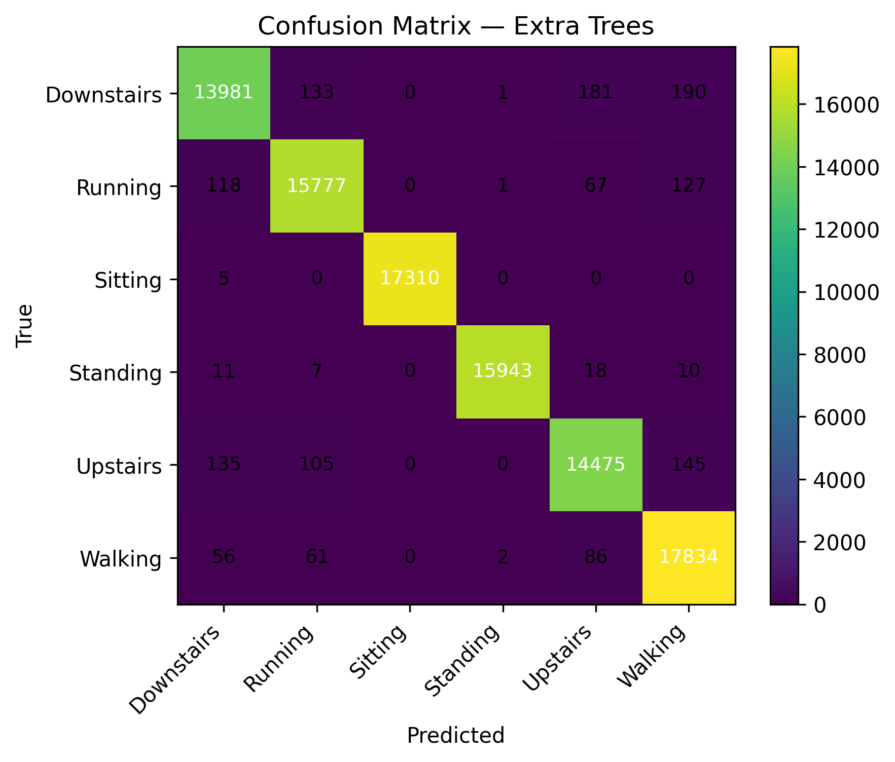
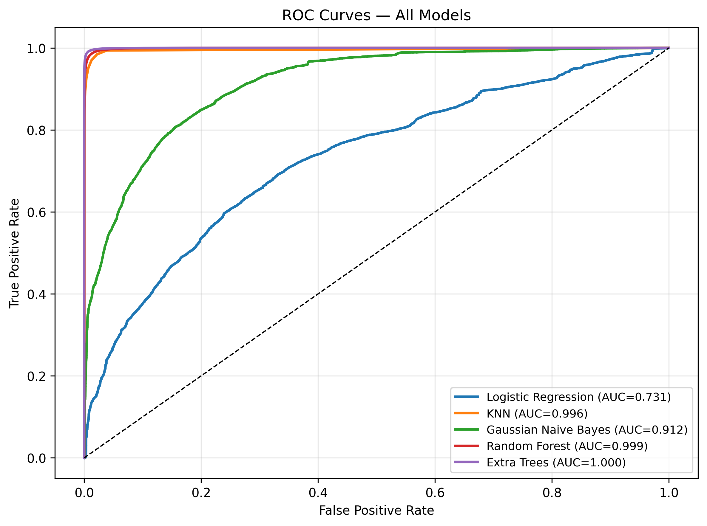
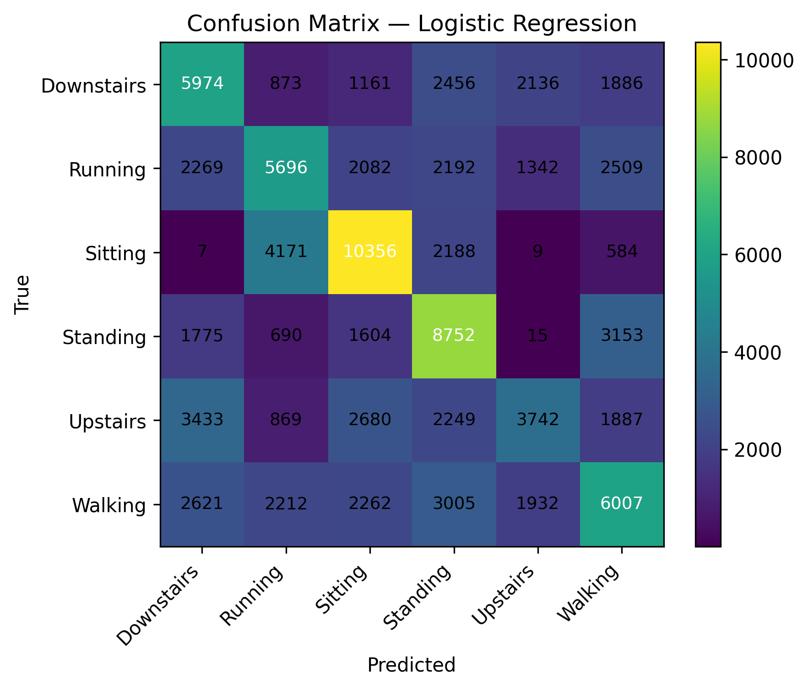
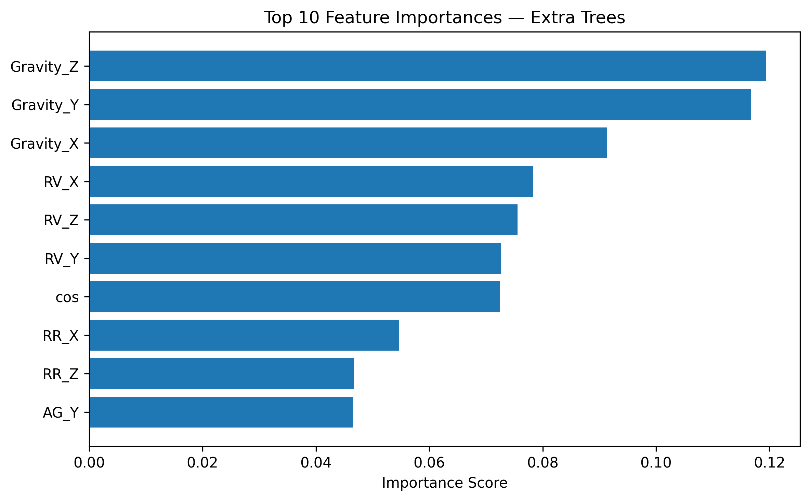

# High-Performance Human Activity Recognition in Uncontrolled Environments

Ensemble machine learning for smartphone-based Human Activity Recognition (HAR), evaluated on the **Wild-SHARD** dataset — a real-world, uncontrolled-environment sensor dataset that better reflects everyday smartphone usage than lab-collected benchmarks.

This repository contains the full experimental pipeline, results, and an accompanying (unpublished) research paper comparing five classical machine learning models for recognizing six physical activities from raw accelerometer and gyroscope signals.

> 📄 **Paper (unpublished):** [`docs/paper.pdf`](docs/paper.pdf)
> 📊 **Dataset:** [Wild-SHARD on IEEE DataPort](https://ieee-dataport.org/documents/wild-shard-smartphone-sensor-based-human-activity-recognition-dataset-wild)

---

## Overview

Most HAR systems are trained and validated in controlled lab conditions, where phone placement and user motion are constrained. In real-world ("in-the-wild") use, phone position varies, motion patterns differ across users, and sensor noise increases — all of which degrade the performance of models that looked strong in the lab.

This project benchmarks five classical ML models under **identical preprocessing and evaluation conditions** on Wild-SHARD (483,895 samples, 6 activity classes, 17 sensor-derived features) to identify which model families are actually robust to this kind of real-world noise.

**Activities classified:** Walking · Sitting · Running · Standing · Upstairs · Downstairs

## Key Results

| Model | Accuracy | Precision (weighted) | Recall (weighted) | F1-Score (weighted) |
|---|---|---|---|---|
| **Extra Trees (ET)** | **0.9849** | **0.9849** | **0.9849** | **0.9849** |
| Random Forest (RF) | 0.9729 | 0.9729 | 0.9729 | 0.9729 |
| K-Nearest Neighbors (KNN) | 0.9571 | 0.9572 | 0.9571 | 0.9570 |
| Gaussian Naive Bayes (GNB) | 0.6424 | 0.6533 | 0.6424 | 0.6408 |
| Logistic Regression (LR) | 0.4188 | 0.4147 | 0.4188 | 0.4114 |

**Extra Trees** was the best-performing model overall, achieving 98.49% accuracy with strong, consistent performance across all metrics — outperforming a KNN baseline reported on the same dataset in prior work (96.86%, Nafea et al. 2025). Tree-based ensembles clearly outperform linear/probabilistic baselines on this noisy, uncontrolled sensor data. Full analysis, confusion matrices, and ROC curves are in the paper.

## Repository Structure

```
.
├── README.md
├── LICENSE
├── requirements.txt
├── .gitignore
├── docs/
│   ├── paper.pdf                  # Full research paper (unpublished)
│   └── workflow_diagram.png       # System workflow figure (Fig. 1 in the paper)
├── notebooks/
│   └── har_wildshard_pipeline.ipynb   # Full preprocessing + training + evaluation pipeline
└── results/
    ├── figures/                   # Confusion matrices, ROC curves, feature importance plots
    └── model_results.csv          # Metrics table generated by the notebook
```

> **Note:** raw data files (e.g. `gaitmotion.xlsx`, `gaitmotion_cleaned.csv`) are not included in this repo due to size and dataset licensing — see [Dataset Access](#dataset-access) below.

## Methodology

The pipeline (see [`docs/workflow_diagram.png`](docs/workflow_diagram.png) for the visual overview) follows these stages:

1. **Data Cleaning** — remove incomplete/inconsistent records from the raw sensor readings.
2. **Feature Preparation** — 17 sensor-derived features: angular velocity (`AG_X/Y/Z`), linear acceleration (`Acc_X/Y/Z`), gravity components (`Gravity_X/Y/Z`), rotation-related features (`RR_X/Y/Z`, `RV_X/Y/Z`), and a cosine-based motion/gravity angle feature.
3. **Label Encoding & Dataset Split** — activity labels encoded numerically; 80/20 train/test split (`random_state=42`, stratified).
4. **Feature Scaling** — `StandardScaler`, applied within a pipeline for the linear/distance-based models (LR, KNN, GNB); included for RF/ET for consistency.
5. **Model Training** — five classifiers trained under identical conditions:
   - Logistic Regression (`max_iter=5000`)
   - Gaussian Naive Bayes
   - K-Nearest Neighbors (`k=7`)
   - Random Forest (`n_estimators=300`)
   - Extra Trees (`n_estimators=300`)
6. **Evaluation** — accuracy, weighted precision/recall/F1, confusion matrices, and one-vs-rest ROC/AUC curves.

## Getting Started

### Prerequisites

- Python 3.9+
- Jupyter Notebook / JupyterLab or Google Colab

### Installation

```bash
git clone https://github.com/tarekjundi10/HAR-WildSHARD-EnsembleML.git
cd HAR-WildSHARD-EnsembleML
pip install -r requirements.txt
```

### Usage

1. Obtain the Wild-SHARD dataset (see [Dataset Access](#dataset-access)) and place it in the project root as `gaitmotion.xlsx`.
2. Open and run `notebooks/har_wildshard_pipeline.ipynb` top to bottom. It will:
   - Clean the raw data and save `gaitmotion_cleaned.csv`
   - Train and evaluate all five models
   - Save `model_results.csv` and all figures (confusion matrices, ROC curves, feature importance)

## Dataset Access

This project uses the **Wild-SHARD** dataset (Choudhury & Soni, 2024), hosted on IEEE DataPort:

🔗 https://ieee-dataport.org/documents/wild-shard-smartphone-sensor-based-human-activity-recognition-dataset-wild

The raw dataset is **not redistributed** in this repository. Please download it directly from the source above under its original license terms.

## Results & Analysis

Detailed results — including per-class confusion matrix breakdowns, ROC/AUC curves per model, feature importance rankings, and a comparison against prior published work on Wild-SHARD — are provided in the accompanying paper: [`docs/paper.pdf`](docs/paper.pdf).

### Visual Preview

<table>
<tr>
<td width="50%">

**Extra Trees — Confusion Matrix**


</td>
<td width="50%">

**ROC Curves — All Models**


</td>
</tr>
<tr>
<td width="50%">

**Logistic Regression — Confusion Matrix**


</td>
<td width="50%">

**Extra Trees — Top 10 Feature Importance**


</td>
</tr>
</table>

All confusion matrices and ROC curves (per-model and combined) are available in [`results/figures/`](results/figures/).

## Citation

This work has not yet been published in a venue or conference. If you use this code, methodology, or findings, please cite it as:

```bibtex
@misc{eljundi2026har,
  author       = {El Jundi, Tarek and Alayedi, Mohanad},
  title        = {High-Performance Human Activity Recognition in Uncontrolled Environments
                  Using Ensemble Machine Learning and Smartphone Inertial Sensors},
  year         = {2026},
  howpublished = {GitHub repository},
  url          = {https://github.com/tarekjundi10/HAR-WildSHARD-EnsembleML}
}
```

## Authors

- **Tarek El Jundi** — Dept. of Software Engineering, Haliç University, Istanbul, Türkiye — `23352525028@ogr.halic.edu.tr`
- **Mohanad Alayedi** — Dept. of Software Engineering, Haliç University, Istanbul, Türkiye — `mohanadysalayedi@halic.edu.tr`

## License

This project's code is released under the [MIT License](LICENSE). The Wild-SHARD dataset is subject to its own separate license — refer to the [IEEE DataPort page](https://ieee-dataport.org/documents/wild-shard-smartphone-sensor-based-human-activity-recognition-dataset-wild) for terms.

## Acknowledgments

- Wild-SHARD dataset by Choudhury & Soni (2024), IEEE DataPort.
- Built with [scikit-learn](https://scikit-learn.org/), pandas, NumPy, and Matplotlib.
